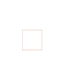
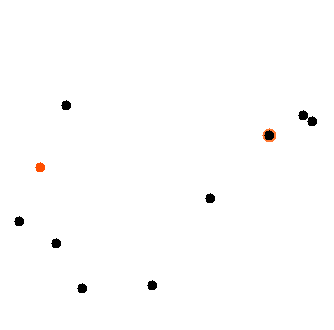

# GeoML

GeoMl is 2D geometry library for Ocaml. It focuses on euclidean geometry
and provides basic types and operations over geometric shapes.
Here an example showing a way to construct geometrically a golden rectangle from four points defining a square:
```ocaml
  Open Geom
  ...
  let gold_rect (a,b,c,d) =
    let e = Point.center a b and ab = Line.of_points a b in
    let circ = Point.distance e c |> Circle.make e in
    let f =
      match Circle.line_intersection circ ab with
      | [x;y] -> if Point.sq_distance a x > Point.sq_distance a y then x else y
      | _ -> assert false
    in
    let fg = Line.perpendicular_of_line ab f and dc = Line.of_points d c in
    let g = Line.intersection fg dc in
    Rectangle.make d (Point.distance d g) (Point.distance d a)
```



It also implements several cool algorithms :

* Emo Welzl's smallest enclosing disk algorithm


* Graham's scan method for finding a convex hull.
* Weiler-Atherton for polygon clipping
* Ear-clipping Algorithm for Polygon triangulation (Mei, Tipper & Xu)

You can see some examples of application in the **tests** directory (You'll need **Graphics**)
##### Build
- The library : **make** 
- The documentation : **make doc**
- The tests : **make tests**

##### Compile
- bytecode: **ocamlc** geom.cma your_files.ml
- native code: **ocamlopt** geom.cmxa your_files.ml

*PS: you'll have to open the Geom module to access the sub-modules (Point, Line ... etc)*

##### Current
GeoML is currently still in developpement, and have not been tested -nor proved, nor model-checked nor analyzed ... but you know what we say about well typed program ;) -. Thereby, you'll may find some weird behaviors or failures. Feel free to let us know or report an issue about it.

You are also welcome to contact any member of the developpement team if you want to suggest a feature you think it may be cool to have in GeoML.